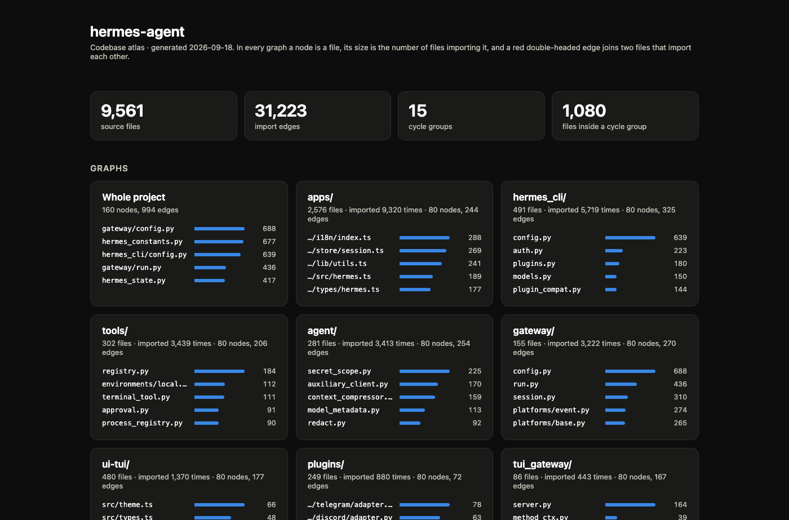
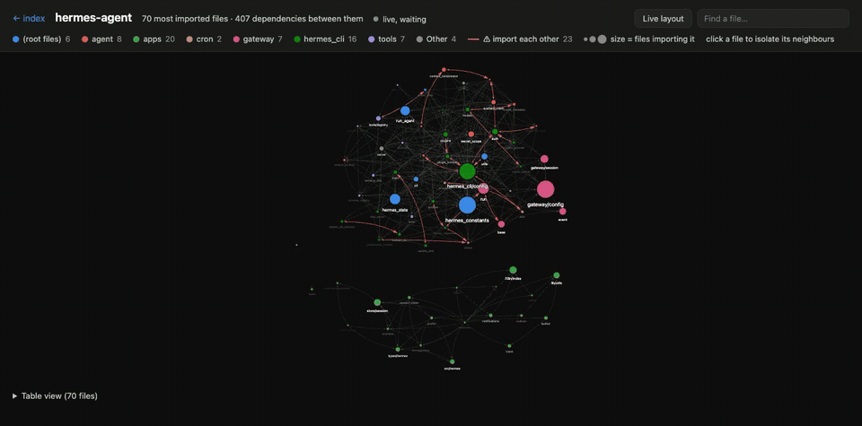
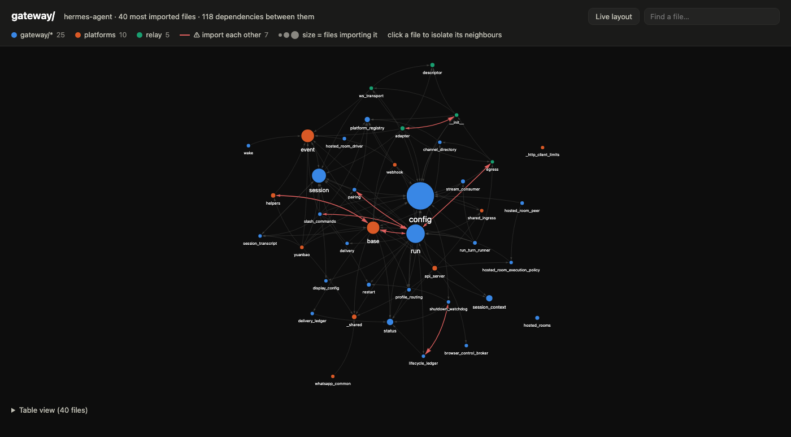

# codebase-graph-mcp





*Example: [hermes-agent](https://github.com/NousResearch/hermes-agent), about 9,500 source files. Top: the atlas home page. Bottom: live pulse while its modules load.*

An MCP server that builds a dependency graph of your codebase, enabling AI coding assistants to understand project structure and make safer changes.

## Problem

AI coding assistants read files one at a time. They don't know which files depend on each other. When they change a file, they can't predict what breaks. This wastes tokens and causes bugs.

## Solution

This MCP server scans your project, builds a dependency graph, and exposes it through 12 tools covering dependency analysis, impact prediction, cycle detection, git history insights and interactive visualization: single graphs, a whole-project atlas, and a live pulse mode that lights up the files a running Python program is executing.

## Tools

### Dependency Analysis

| Tool | Description |
|------|-------------|
| `get_dependencies` | What does this file import? |
| `get_dependents` | What files import this file? |
| `impact_analysis` | If I change this file, what else is affected? (recursive BFS) |
| `multi_file_impact` | Combined impact of multiple changed files. Accepts file list or git diff ref. |
| `project_overview` | High-level view: file counts, most imported files, entry points, orphans |
| `refresh_graph` | Force re-scan after file changes |

### Architecture

| Tool | Description |
|------|-------------|
| `detect_cycles` | Find circular dependencies using Tarjan's SCC algorithm |
| `package_dependencies` | Package/module level dependency view with configurable depth |
| `class_hierarchy` | Python class inheritance tree, methods, and subclass overrides |
| `visualize_graph` | Interactive HTML graph, or with `atlas=true` a folder with an index and a graph per major directory; the pages go live under the pulse sampler |

### Git History

| Tool | Description |
|------|-------------|
| `file_churn` | Most frequently changed files in git history (hotspot detection) |
| `co_change` | Files that frequently change together (hidden coupling detection) |

## Asking Your Assistant

Once connected there is nothing to learn: ask in plain language and the assistant picks the tool.

| You ask | Tool used |
|---|---|
| "What breaks if I change `src/auth/session.ts`?" | `impact_analysis` |
| "Who imports `config.py`?" | `get_dependents` |
| "I changed these files since `main`, what should I re-test?" | `multi_file_impact` with `diff_ref` |
| "Are there circular imports? How bad are they?" | `detect_cycles` |
| "Which files are the riskiest to touch?" | `project_overview` + `file_churn` |
| "What usually changes together with `run.py`?" | `co_change` |
| "Which classes override `connect`?" | `class_hierarchy` |
| "Draw this project" / "make an atlas of `apps/desktop/src`" | `visualize_graph` |

A good habit for coding agents: call `impact_analysis` before editing a widely imported file and `multi_file_impact` before declaring a change done.

## Resources and Prompts

Besides the tools the server exposes three MCP resources, read against `PROJECT_ROOT` (or the working directory):

| Resource | Content |
|---|---|
| `codebase://overview` | File counts, most imported files, entry points, orphans (JSON) |
| `codebase://graph` | The full adjacency list: each file with its dependencies and dependents (JSON) |
| `codebase://cycles` | Cycle groups with their sizes and shortest loops (JSON) |

and three prompts that pre-fill a request with graph data:

| Prompt | Argument | Asks the model to |
|---|---|---|
| `analyze-impact` | `file` | Assess the risk of changing one file, given its dependencies, dependents and blast radius |
| `find-hotspots` | none | Rank the riskiest files from import counts and 90-day churn |
| `review-pr` | `diff_ref` | Review the files changed since a git ref together with everything they affect |

## Supported Languages

- **TypeScript / JavaScript** (`.ts`, `.tsx`, `.mts`, `.cts`, `.js`, `.jsx`, `.mjs`, `.cjs`) — static, side-effect, dynamic and `require()` imports, multi-line and `import type` forms, `.js` -> `.ts` ESM rewrites, index files, `tsconfig.json`/`jsconfig.json` `paths` and `baseUrl` (including `extends`)
- **Python** (`.py`) — absolute and relative imports, `from pkg import submodule`, parenthesized multi-line imports, namespace packages, imports under `if TYPE_CHECKING:` (tracked as type-only)
- **Rust** (`.rs`) — `use crate::`, `use super::`, `use self::`, `mod`/`pub mod` declarations, glob and brace-group imports, items defined in the parent module file, nearest `Cargo.toml` decides what `crate::` means
- **Cargo.toml** — workspace cross-crate dependency parsing (resolves `[workspace.dependencies]` path mappings)
- **Config files** (`.json`, `.json5` under `config/`) — module references in the [OpenMind OM1](https://github.com/OpenmindAGI/OM1) config layout only; other projects get no config edges

Type-only imports (TS `import type`, Python `TYPE_CHECKING`) and Rust `mod` declarations are kept as dependencies but never count as circular dependencies, since they are the standard ways to break a runtime cycle.

## Installation

### 1. Build from source (required)

```bash
git clone https://github.com/0xbyt4/codebase-graph-mcp.git
cd codebase-graph-mcp
npm install
npm run build
npm test   # optional: fixture-based tests, needs git on PATH
```

Requires Node.js 18+. `git` is used for the history tools and, inside a repository, for the file list (so `.gitignore` is honoured). Outside a repository the tree is walked with a built-in ignore list (`node_modules`, `.git`, `dist`, `build`, `target`, `venv`, `env`, `vendor`, ...).

### 2. Connect to your AI assistant

#### Claude Code (CLI)

```bash
claude mcp add -s user codebase-graph -- node /path/to/codebase-graph-mcp/build/index.js
```

#### Claude Code (manual config)

Add to `~/.claude.json`:

```json
{
  "mcpServers": {
    "codebase-graph": {
      "type": "stdio",
      "command": "node",
      "args": ["/path/to/codebase-graph-mcp/build/index.js"],
      "env": {
        "PROJECT_ROOT": "/path/to/your/project"
      }
    }
  }
}
```

#### Hermes Agent (`config.yaml`)

```yaml
mcp_servers:
  codebase-graph:
    command: "node"
    args: ["/path/to/codebase-graph-mcp/build/index.js"]
    env: {}
```

Any other MCP client works the same way: a stdio server started with `node build/index.js`.

### Project Root Resolution

All tools accept an optional `project_root` parameter. Resolution order:

1. `project_root` parameter in tool call (if provided)
2. `PROJECT_ROOT` environment variable (if set)
3. Current working directory (default)

File arguments must stay inside the project root; anything that resolves outside it (including through a symlink) is rejected. A file the scan never saw is reported as an error rather than as "unused". `visualize_graph` only writes `.html` files and never overwrites a file it did not generate. Scans stop at 50,000 files and say so in the output.

Note that `project_root` itself is chosen by the caller: the server will read (and, for `visualize_graph`, write one HTML file into) any directory the process user can access. Set `PROJECT_ROOT` and drop the parameter if the assistant should be limited to one project.

## Example Output

### impact_analysis

```
Impact analysis for src/providers/singleton.py:

Directly affected (46):
  - src/providers/asr_provider.py
  - src/providers/config_provider.py
  - src/providers/io_provider.py
  ...

Indirectly affected (3):
  - src/providers/avatar_llm_state_provider.py
  - src/providers/__init__.py
  - src/providers/llm_history_manager.py

Total affected files: 49
```

### detect_cycles

```
Found 2 circular dependencies involving 41 files:

Cycle 1 (2 files; shortest loop in a group of 38 mutually dependent files):
  src/core/state.py -> src/core/events.py -> src/core/state.py

Cycle 2 (3 files):
  src/a.py -> src/b.py -> src/c.py -> src/a.py
```

Each cycle is the shortest loop through one group of mutually dependent files (a strongly connected component), largest group first. The group size matters more than the loop: a 2-file loop can be the visible tip of hundreds of entangled files. Each file is listed once; the trailing entry closes the loop. A cycle that only exists through `import type` / `TYPE_CHECKING` imports is not reported.

### class_hierarchy

```
Class: OdomProviderBase
File: src/providers/odom_provider_base.py
Bases: SingletonProvider

Methods (5):
  - get_odom
  - reset
  - start
  - stop
  - update

Subclasses (4):
  TronOdomProvider (src/providers/tron_odom_provider.py)
    overrides: start, stop, update
  Turtlebot4OdomProvider (src/providers/turtlebot4_odom_provider.py)
    overrides: start, stop, update
  UnitreeG1OdomProvider (src/providers/unitree_g1_odom_provider.py)
    overrides: start, stop
  UnitreeGo2OdomProvider (src/providers/unitree_go2_odom_provider.py)
    overrides: start, stop, update
```

### file_churn

```
File churn (last 90 days, 234 commits):

File                                                     Commits      First       Last
──────────────────────────────────────────────────────── ─────── ────────── ──────────
src/providers/io_provider.py                                  18 2025-12-02 2026-02-15
src/actions/move/connector/ros2.py                            14 2025-12-14 2026-02-10
src/runtime/config.py                                         12 2026-01-05 2026-02-18
```

### co_change

```
Co-change analysis for src/providers/singleton.py (12 changes in 90 days):

File                                                    Together     Total  Corr
─────────────────────────────────────────────────────── ───────── ────── ─────
src/providers/io_provider.py                                   8     18  0.67
src/providers/config_provider.py                               6     10  0.60
src/runtime/config.py                                          5     12  0.42
```

### visualize_graph



Generates an interactive HTML graph and opens it in the browser.

- **Size** of a node is the number of files importing it; label size follows, so hubs stay readable when zoomed out
- **Color** is the directory below the scope, from a fixed 8-color palette validated for color-blind separation on light and dark surfaces (more directories fold into "Other")
- **Red double-headed edges** join two files that import each other at runtime, the smallest and most fixable kind of cycle
- Click a file to isolate its neighbours, use the search box to jump to a file, hover for the full path and counts
- The layout is computed once and then held still so labels stay readable; the **Live layout** button turns the physics back on, so dragging a file pulls its cluster along, and freezes it again on the next click
- A table view under the graph lists every file with the same numbers, and the page follows the OS light or dark theme

The page loads a pinned vis-network build from jsDelivr with an integrity hash, so it needs network access when opened.

```
# All files (top 50)
visualize_graph(top=50)

# Only files under gateway/, ranked within that scope
visualize_graph(scope="gateway", top=30)

# Custom output path (must be inside the project root); skip the browser
visualize_graph(output="docs/graph.html", open_browser=false)

# Atlas: a folder with an index page, a whole-project graph and one graph per major directory
visualize_graph(atlas=true)

# Atlas of one area: a graph per subdirectory of apps/desktop/src, at most 5 of them
visualize_graph(atlas=true, scope="apps/desktop/src", max_scopes=5, output="tmp/desktop-atlas")
```

#### Atlas mode

On a large project one graph is not enough, so `atlas=true` writes a folder (default `codebase_atlas/`):

- `index.html` with project totals, a card per graph (its five most imported files as a bar list), the ten most imported files overall, and every cycle group with its size and shortest loop
- `all.html` for the whole project (twice `top` files)
- one page per major directory, named after it (`gateway.html`, `apps_desktop_src.html`)

Directories are direct children of the project root (or of `scope`), ranked by how often their files are imported, so test-only and leaf directories drop out on their own; `max_scopes` (default 8, max 20) caps how many get a page. Only the index is opened in the browser, every page links back to it, and as with single graphs nothing is overwritten unless this tool generated it.

Output:
```
Graph saved to /path/to/project/codebase_graph.html

Nodes: 50
Edges: 224

Top 10 most imported:
  128 <- gateway/config.py
  103 <- hermes_constants.py
   91 <- hermes_cli/config.py
   81 <- gateway/platforms/base.py
   53 <- gateway/session.py

Opened in browser.
```

### package_dependencies

```
Package Dependencies (depth=2, 8 packages, 45 cross-package edges):

src/providers (47 files)
  -> src/zenoh_msgs, src/runtime
  <- src/actions, src/inputs, src/fuser

src/actions (82 files)
  -> src/providers, src/inputs, src/llm
  <- src/runtime
```

## Live Pulse

The graph pages can show a running Python program: the files it is executing glow, signals travel along the import edges from caller to callee, and a file where a thread or an asyncio task is parked (network wait, sleep, lock) breathes slowly. On the atlas index the card of the directory that is executing lights up. A status line names the current file even when it is not among the nodes shown.

Generate an atlas, then start your program through the sampler instead of plain `python`:

```bash
# visualize_graph(atlas=true, output="tmp/atlas") first, then:
python /path/to/codebase-graph-mcp/pulse/codebase_pulse.py --root . --pages tmp/atlas --open -m your_package.main
python /path/to/codebase-graph-mcp/pulse/codebase_pulse.py --root . --pages tmp/atlas --open -c your_package.cli:main -- --your --args
python /path/to/codebase-graph-mcp/pulse/codebase_pulse.py --root . --pages tmp/atlas --open script.py
```

The program runs as usual in your terminal; the printed URL (opened by `--open`) serves the pages from the same process. A page opened late first replays the last 20 seconds, so start-up imports are visible too.

How it works and what it costs: a daemon thread looks at `sys._current_frames()` about 20 times a second, which is sampling, not tracing. There is no per-call hook and no measurable slowdown, but calls shorter than the gap between two samples can be missed. A stack whose innermost frame has not moved since the previous sample counts as parked rather than active; suspended asyncio tasks are found through their running loop and reported where they await.

What leaves the process: project-relative file paths and a millisecond counter. No source, no variable values, no arguments. The server binds to `127.0.0.1`, rejects any `Host` other than itself (DNS rebinding), requires a random per-run token (then a `SameSite=Strict`, `HttpOnly` cookie for linked pages), sends no CORS headers, and serves only the `.html` files directly inside `--pages`. Standard library only, Python 3.8+. Only Python programs are covered; files outside the top-N of a page show up in the status line but have no node to light, so generate live atlases with a larger `top`.

## How It Works

1. Lists source files: `git ls-files` inside a repository (honours `.gitignore`), otherwise a directory walk with a built-in ignore list. Symlinks are never followed; unreadable directories are skipped; files over 1 MB and lines over 5,000 characters are treated as generated and not parsed.
2. Parses import/export statements using regex (zero external parser dependencies)
3. Resolves relative and absolute imports to actual files
   - TypeScript: `.js` -> `.ts` ESM convention, index files, `tsconfig`/`jsconfig` `paths` and `baseUrl`
   - Python: relative imports, absolute project imports from `src/`, `lib/`, `app/`, the root, or any ancestor of the importing file; `from pkg import name` resolves `name` as a submodule when it is one
   - Rust: `crate::` (nearest `Cargo.toml`), `super::`, `self::`, `mod` declarations, `mod.rs`/`lib.rs`/`main.rs`; items that live in the parent module file resolve to that file
4. Builds an adjacency list graph (dependencies + reverse dependencies), flagging type-only edges and Rust `mod` declarations
5. Parses OM1-style config files for module references
6. Parses `Cargo.toml` workspace for cross-crate dependency edges (maps `[workspace.dependencies]` path entries to crate entry points)
7. Builds class inheritance hierarchy from Python files
8. Caches the graph in memory per project root for 5 minutes, refresh with `refresh_graph`

## Limitations

- **File level, not symbol level.** The graph knows that `a.py` imports `b.py`, not which function calls which. "Who calls this function" is out of scope.
- **Static imports only.** Imports are found with regular expressions, not a parser. A path computed at runtime (`importlib.import_module(name)`, `require(variable)`, plugin discovery by directory listing) produces no edge, so a file reported as having no dependents may still be loaded dynamically.
- **Python, TypeScript/JavaScript and Rust.** Other languages are ignored. Config-file edges exist only for the OM1 layout, class hierarchy only for Python.
- **TypeScript aliases** come from `tsconfig.json`/`jsconfig.json` `paths` and `baseUrl`; bundler-only aliases (Vite, webpack) and `package.json` `imports` are not read.
- **Graph pages show the top N files**, not every file; raise `top` or use an atlas to see more. They load vis-network from a CDN and need network access when opened.
- **Live pulse** covers Python programs started through the sampler: it cannot attach to a process that is already running, does not follow subprocesses, and samples rather than traces, so very short calls can be missed.
- Scans stop at 50,000 files; files over 1 MB are treated as generated and skipped.

## Design Principles

- **Minimal runtime dependencies**: the MCP SDK, zod and json5
- **Regex-based parsing** — no AST parsers, no native binaries, instant startup
- **Works offline** — no API calls, no cloud services
- **Multi-project support** — cache per project root, switch between projects freely
- **Language agnostic architecture** — easy to add new language support

## Project Structure

```
src/
  index.ts           -> MCP server + 12 tool definitions
  parser.ts          -> Regex-based import parser (TS/JS + Python + Rust)
  graph.ts           -> Dependency graph engine + cycle detection + package analysis
  class-analyzer.ts  -> Python class hierarchy extraction
  config-parser.ts   -> Config file module reference parser
  cargo-parser.ts    -> Cargo.toml workspace cross-crate dependency parser
  git-history.ts     -> Git log analysis (churn + co-change), git ref validation
  paths.ts           -> Project root normalization and path containment checks
  visualize.ts       -> HTML graph pages, atlas directory selection and index page
  pulse-client.ts    -> Browser code for live pulse mode, embedded in the pages
pulse/
  codebase_pulse.py  -> Stack sampler + local event server for live pulse (Python, stdlib only)
test/
  fixtures/          -> Small TypeScript, Python and Rust projects the tests run against
  *.test.mjs         -> node:test suites (parser, graph, git, paths, end-to-end server)
```

## License

MIT
